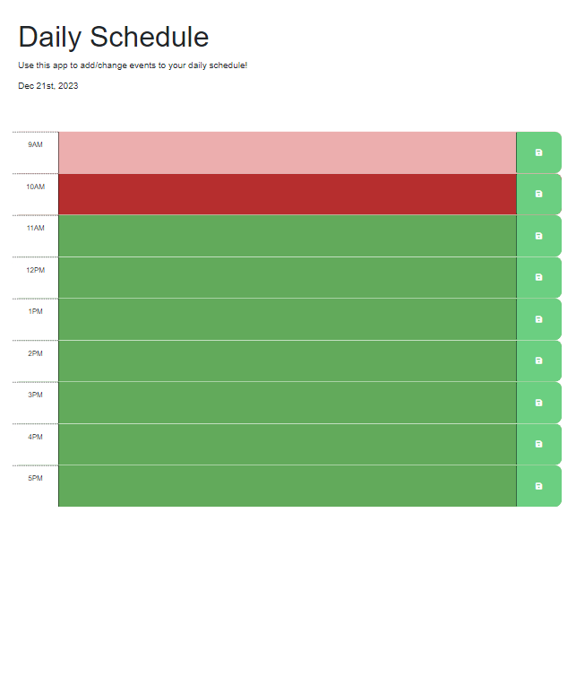

The challenge asked for a workday schedule for the hours of 9 am to 5 pm. It required that the past, present and future time slots be signified by color. This was done with 
red for past, solid green for present, and light green for future. Javascript localstorage was used to save entries into the time slots, when refreshing the page, the entries remain.
Dayjs was used to set the current day to whichever day it is in real time. A button functionality was added to each save button to store in local storage.

## User Story
AS AN employee with a busy schedule
I WANT to add important events to a daily planner
SO THAT I can manage my time effectively
```
GIVEN I am using a daily planner to create a schedule
WHEN I open the planner
THEN the current day is displayed at the top of the calendar
WHEN I scroll down
THEN I am presented with timeblocks for standard business hours of 9am-5pm
WHEN I view the timeblocks for that day
THEN each timeblock is color coded to indicate whether it is in the past, present, or future
WHEN I click into a timeblock
THEN I can enter an event
WHEN I click the save button for that timeblock
THEN the text for that event is saved in local storage
WHEN I refresh the page
THEN the saved events persist
```



Documentation used:

[jQuery Docs on Traversing](https://api.jquery.com/category/traversing) 

[jQuery Docs on Event Delegation](https://learn.jquery.com/events/event-delegation/)

[Bootstrap Documentation for the Grid](https://getbootstrap.com/docs/5.1/layout/grid/)

[jQuery UI Demos](https://jqueryui.com/demos/)

[Day.js Docs](https://day.js.org/docs/en/display/format)

Deployed Application:

https://justmoonflower.github.io/sushi/